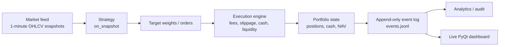

# Levitate / Hermis Simulator Features

This document collects the important engineering and research features of the simulator so they can be highlighted in the GitHub repository, thesis notes, resumes, project reports, and future papers.

The central point is simple: this is not just a vectorized backtest script. It is an event-driven portfolio simulation stack with realistic execution constraints, online strategy hooks, live monitoring, and post-run forensic tooling.

---

## 1. One-line positioning

**Levitate / Hermis is a config-driven, event-sourced, minute-level portfolio backtesting engine for online allocation strategies, with realistic paper execution, liquidity-aware capacity controls, live PyQt monitoring, and audit tools for explaining NAV/fill anomalies.**

---

## 2. Core architecture

The simulator is built around an event pipeline:



The strongest design choice is that **events are the source of truth**. NAV series, fills tables, trades, positions, spike audits, and UI panels are all derived from the same event stream instead of being separately maintained inconsistent outputs.

Relevant modules:

```text
common/events.py              Event schemas: snapshots, orders, fills, positions
runner/engine.py              Main async event loop and strategy/execution wiring
execution/paper.py            Paper execution and portfolio accounting
market_feed/*.py              Synthetic, folder, cube, and sanitized feeds
analytics/*.py                Post-run analytics and NAV spike audit
ui/qt_dashboard.py            Live PyQt dashboard
configs/**/*.yaml             Reproducible experiment configuration
```

---

## 3. Event-driven simulation instead of vectorized backtesting

Many toy backtests compute portfolio value with one vectorized matrix expression. That is fast, but it hides important details: order timing, cash availability, fills, whole-share constraints, trade sequencing, and debugability.

This simulator works tick by tick:

1. A `MarketSnapshot` arrives from the feed.
2. The execution engine marks the portfolio to market.
3. The strategy observes the market and current portfolio state.
4. The engine converts target weights into whole-share orders.
5. Paper execution applies slippage, fees, cash constraints, and liquidity constraints.
6. Fills and position snapshots are appended to `events.jsonl`.
7. The dashboard receives live NAV, fill, and learning telemetry through ZMQ.

This matters because online portfolio learning is naturally sequential. Decisions at time `t` must only use information available up to time `t`; the event loop structure makes that constraint explicit.

---

## 4. Config-driven reproducibility

Experiments are assembled from YAML modules:

```text
configs/run/*.yaml
configs/market_feed/*.yaml
configs/execution/*.yaml
configs/strategy/*.yaml
configs/ui/*.yaml
```

A run config references individual module configs, and the loader merges them into a single effective config. This makes experiments reproducible and easy to compare.

Example run module structure:

```yaml
modules:
  market_feed: ../market_feed/sanitized_cube_feed.yaml
  execution:   ../execution/paper_fixed_bps.yaml
  strategy:    ../strategy/xs_mom_vol_ema_stop.yaml
  ui:          ../ui/qt_dashboard.yaml
```

Key benefit: the same engine can run synthetic tests, raw folder feeds, matrix-store feeds, sanitized feeds, momentum strategies, RL strategies, and sparse allocation strategies by changing YAML, not rewriting the runner.

---

## 5. Multi-asset one-minute market data support

The simulator supports several feed modes:

### 5.1 Synthetic feed

`market_feed/synthetic.py` generates synthetic one-minute snapshots for fast sanity checks and smoke tests.

Use case:

```text
Before trusting a real-data strategy, test that the engine, execution, dashboard, and event log behave correctly on controlled data.
```

### 5.2 Folder-based 1-minute feed

`market_feed/folder_1m.py` reads per-symbol CSV/parquet files, aligns them onto a common timestamp calendar, and supports automatic symbol discovery.

Important details:

- supports recursive symbol discovery;
- supports configurable timestamp, price, and volume columns;
- supports optional universe files;
- can forward-fill prices if configured;
- does **not** forward-fill volume, because volume is an interval quantity.

### 5.3 Matrix-store 1-minute feed

`market_feed/matrix_store_1m.py` reads a prebuilt cube store:

```text
processed_data/<dataset>/1m_cube_store/date=YYYY-MM-DD/close.parquet
processed_data/<dataset>/1m_cube_store/date=YYYY-MM-DD/volume.parquet
```

Each daily parquet file is a matrix:

```text
rows    = minute timestamps
columns = symbols
values  = close price / volume / OHLC field
```

This is much better than loading hundreds of per-symbol CSVs every run. It reduces startup overhead and keeps memory usage controlled by loading one trading day at a time.

### 5.4 Sanitized matrix feed

`market_feed/sanitized_matrix_store_1m.py` adds a runtime guard against isolated bad ticks.

It rejects absurd one-minute jumps, but it can also **rebase** after multiple consecutive stable bars so that a persistent level shift does not permanently delete a symbol from the stream.

This distinction is important:

```text
one-off bad print            -> reject
persistent new price regime  -> cautiously rebase
```

That is safer than either blindly accepting all prices or permanently suppressing a symbol after one jump.

---

## 6. Data preprocessing and universe preservation

The preprocessing pipeline builds reusable stores from raw minute CSVs:

```text
raw CSV files
    -> 1m_long_store partitioned by date and symbol
    -> 1m_cube_store daily OHLCV matrices
```

Relevant module:

```text
preprocess/build.py
```

Important features:

- market-hour filtering, e.g. NSE `09:15:00` to `15:30:00`;
- configurable OHLCV column names;
- chunked CSV reading for large raw files;
- parquet output for reusable fast backtests;
- optional universe filtering;
- explicit global-symbol preservation in cube matrices.

The universe-preservation logic is important. A daily matrix may not have quotes for every symbol every day, but that should not cause the symbol universe to shrink structurally. The cube builder can preserve all discovered symbol columns across daily partitions while leaving missing quotes as `NaN`.

That is the correct behavior:

```text
Preserve the symbol column.
Do not invent a fake price.
Let the feed/execution decide how to handle missing quotes.
```

---

## 7. Realistic paper execution

The paper execution engine is more realistic than a pure return-matrix backtest.

Relevant modules:

```text
execution/paper.py
execution/portfolio.py
execution/slippage.py
runner/engine.py
```

It supports:

- whole-share positions;
- cash accounting;
- long-only position updates;
- fixed-bps slippage;
- fixed-bps fees;
- order acknowledgements;
- fill events;
- average-entry trade bookkeeping;
- mark-to-market NAV snapshots;
- held-symbol MTM prices stored in snapshots for later audits.

A strategy does not directly mutate the portfolio. It publishes target weights or orders. The engine and execution layer handle sizing, cash, fills, and accounting.

This separation matters because it prevents the strategy from implicitly assuming fractional shares, infinite cash, or free execution unless those assumptions are deliberately configured.

---

## 8. Liquidity-aware execution constraints

This is one of the most important realism features in the simulator.

The problem it solves:

```text
If a stock is priced at ₹1 and the strategy has ₹10,00,000, a naive simulator may buy 10,00,000 shares instantly.
If the strategy later scales to a huge NAV, it may buy millions/billions/trillions of shares at the displayed close price.
That is not real trading. It assumes infinite liquidity and zero market impact.
```

The fix is not a dumb hard cap like:

```text
max_order_qty = 100000
```

That would be arbitrary and wrong because different stocks have different liquidity.

Instead, the engine supports **data-driven liquidity caps**:

```yaml
execution:
  liquidity:
    enabled: true
    max_bar_participation: 0.10
    max_position_adv_participation: 0.10
    adv_lookback_days: 20
    min_adv_history_days: 5
    require_volume_for_buys: true
    apply_to_sells: true
```

### 8.1 Bar participation cap

At each minute, order size is limited by a fraction of that minute's real traded volume:

```text
max executable quantity <= max_bar_participation * current_bar_volume
```

Example:

```text
current minute volume = 10,000 shares
max_bar_participation = 0.10
maximum buy/sell quantity this minute = 1,000 shares
```

### 8.2 Position ADV cap

The total position can also be capped as a fraction of rolling average daily volume:

```text
max position quantity <= max_position_adv_participation * rolling_ADV
```

Example:

```text
20-day ADV = 5,00,000 shares
max_position_adv_participation = 0.10
maximum allowed position = 50,000 shares
```

### 8.3 Why this is strong

This makes the simulator much closer to reality:

- liquid names naturally allow larger orders;
- illiquid names naturally throttle accumulation;
- cheap stocks are not banned unfairly;
- unrealistic accumulation in penny/low-volume names is prevented;
- the simulator moves gradually toward the target instead of assuming instantaneous infinite fills;
- strategies are evaluated under capacity constraints, not just signal quality.

This feature directly addresses a major failure mode of historical backtests: fake profits caused by buying massive quantities at stale/low prices without affecting the market.

---

## 9. Target-weight portfolio engine

The engine supports strategies that publish target weights through `_last_target_weights`.

The rebalance function converts target weights into whole-share orders using current NAV and current market prices:

```text
target notional = target weight * NAV
desired shares  = floor(target notional / current price)
order quantity  = desired shares - current shares
```

Then execution constraints are applied:

```text
cash constraint
whole-share constraint
bar-volume participation cap
ADV position cap
slippage
fees
```

This design makes strategies easier to write. A strategy can focus on deciding portfolio weights, while the engine handles realistic translation into trades.

The current restored behavior is continuous target tracking:

```text
If a strategy leaves non-empty target weights published, the engine keeps trying to align actual holdings to those weights on every tick.
```

That behavior is useful when liquidity caps are enabled, because the engine may need many bars to slowly accumulate or unwind a position.

---

## 10. Strategy family supported by the simulator

The repo supports multiple strategy styles. This is important because the simulator is not locked to one algorithm.

### 10.1 Toy rebalance strategy

A simple baseline for testing the engine, order generation, event logs, and UI.

### 10.2 Cross-sectional momentum with volatility targeting

`strategy/xs_mom_vol_target.py`

Core logic:

- maintain rolling price history;
- compute momentum signal over a lookback window;
- estimate realized volatility from log returns;
- rank assets cross-sectionally;
- allocate by risk-adjusted momentum, approximately `signal / volatility`;
- apply max gross exposure;
- keep a cash buffer;
- cap per-name weights;
- cap turnover;
- optionally stop trading after portfolio drawdown breach.

### 10.3 Momentum + EMA trend filter + stoploss overlay

`strategy/xs_mom_vol_ema_stop.py`

Additional realism features:

- EMA fast/slow trend gate;
- EWMA volatility estimation;
- optional correlation-to-market penalty;
- trailing stoploss;
- cooldown after stoploss;
- portfolio-level drawdown stop;
- max turnover;
- max per-name weight;
- explicit publish/clear behavior for target weights.

### 10.4 EMA long strategy

`strategy/ema_long.py`

A trend-following long-only allocator with:

- multi-EMA trend filters;
- momentum ranking;
- EWMA volatility targeting;
- dynamic stoploss using volatility;
- minimum holding time;
- trend-break exits;
- session filtering for NSE-style market hours;
- max weight and turnover constraints.

### 10.5 Sparse Sortino optimizer

`strategy/sparse_sortino_optimizer.py`

A sparse online allocation strategy that:

- maintains rolling return history;
- ranks assets by Sortino-style downside-risk-adjusted performance;
- selects at most `max_assets` symbols;
- allocates only among selected assets;
- outputs target weights for the engine.

### 10.6 RL allocator

`strategy/rl_agent/`

The RL strategy is a PPO-style actor-critic allocator.

Key features:

- rolling per-symbol feature encoder;
- short/long momentum features;
- short/long volatility features;
- short/long drawdown features;
- correlation-to-market features;
- trend-slope feature;
- selection of `K` assets without replacement;
- Dirichlet weight allocation over selected assets;
- turnover cap;
- stoploss and cooldown overlay;
- reward shaping with return, turnover penalty, volatility penalty, and drawdown penalty;
- checkpoint support;
- dashboard telemetry through `get_dashboard_metrics()`.

### 10.7 Sparse switching mean-variance research strategy

The research strategy discussed in this project is a sparse, switching-aware, mean-variance-style online allocator.

Conceptually, the strategy is:

```text
Estimate expected returns and risk from rolling market history.
Select a sparse support of at most K assets.
Solve a long-only allocation problem on that support.
Penalize variance/risk.
Penalize switching away from the previous portfolio.
Publish target weights to the engine.
```

Typical objective structure:

```text
return reward
- variance/risk cost
- switching cost
```

Important knobs:

```text
support_K       maximum support size / number of selected assets
variance_cost   strength of covariance/risk penalty
kappa           strength of switching penalty
lookback        history used for estimating returns/covariance
rebalance cadence / target publication cadence
```

Why this matters:

- it connects the simulator to online convex optimization / online portfolio learning;
- it supports sparse portfolios instead of dense allocations over hundreds of names;
- it exposes the tradeoff between return chasing, risk control, and turnover control;
- it is a natural place to add static regret, dynamic regret, comparator loss, and oracle benchmarks.

---

## 11. Online learning telemetry

The engine publishes strategy telemetry on a `learn` ZMQ topic.

If a strategy exposes one of these methods:

```text
get_dashboard_metrics()
get_ui_metrics()
get_telemetry()
```

then the engine forwards its metrics to the dashboard. If not, the engine falls back to generic telemetry such as target weights, NAV, cash, and basic strategy attributes.

This allows online-learning strategies to report:

- regret;
- cumulative regret;
- loss;
- oracle/comparator loss;
- reward;
- selected symbols;
- target weights;
- learner update count;
- replay/buffer size;
- active turnover;
- current hyperparameters.

The key design point is honesty: the dashboard does not fake regret. Regret is meaningful only if the strategy publishes a valid comparator/oracle loss or an explicit regret scalar.

---

## 12. Live PyQt dashboard

`ui/qt_dashboard.py` provides a live monitor through ZMQ.

Current dashboard tabs include:

- Overview;
- Backtest Metrics;
- Positions;
- Fills;
- Online Learning;
- PnL;
- Trades.

The dashboard supports:

- live NAV plot;
- dense time axis without weekend/holiday gaps;
- position table;
- fill stream;
- PnL table;
- trade blotter;
- online backtest metrics;
- online learning metrics and plots.

Backtest metrics include:

```text
Sharpe ratio
Sortino ratio
maximum drawdown
current drawdown
total return
CAGR / annualized return
annualized volatility
annualized mean return
Calmar ratio
hit rate
best/worst sampled return
VaR 90%
CVaR 90%
VaR 99%
CVaR 99%
gross exposure
cash percentage
open positions
closed trades
fill count
estimated periods per year
```

The risk-free rate for Sharpe/Sortino is fixed at 4% annualized in the current dashboard implementation.

---

## 13. NAV spike and forensic audit tooling

Backtests fail silently when there is no audit trail. This simulator has explicit forensic tooling.

Relevant module:

```text
analytics/nav_spike_audit.py
```

The NAV spike auditor can detect large NAV jumps and explain them using:

- previous and current NAV;
- cash change;
- held symbols before the spike;
- held-symbol mark prices;
- estimated symbol-level NAV contribution;
- missing symbols;
- fills between snapshots;
- fill notional between snapshots;
- unexplained residual change after estimated contributions.

Output files:

```text
nav_spikes.csv
nav_spike_contributions.csv
nav_spike_fills.csv
```

This is critical for research credibility. When a strategy reports unrealistic NAV growth, the simulator gives tools to identify whether the source is real price movement, bad data, stale marks, execution accounting, or liquidity abuse.

---

## 14. Data realism and validation features

The simulator has several layers of protection:

### 14.1 Data cleaning / repair notebooks and scripts

The repo contains anomaly repair and investigation workflows for intraday price issues, including corporate-action-like jumps and sudden spikes.

### 14.2 Runtime sanitized feed

The sanitized feed rejects isolated bad bars and cautiously handles persistent level shifts.

### 14.3 Missing-data handling

The feed emits sparse snapshots when symbols are missing at a minute. The execution engine carries forward last known prices for mark-to-market stability, but order generation uses the current snapshot. That distinction is important:

```text
Carry-forward for NAV stability.
No fake volume.
No fake executable quote.
```

### 14.4 Universe preservation

The cube builder preserves the global symbol universe as columns across daily matrices without filling fake prices.

### 14.5 Liquidity constraints

The engine prevents unrealistic capacity by using minute volume and rolling ADV.

---

## 15. Why the liquidity feature is a major improvement

The recent CGCL/UNOMINDA-style issue exposed an important truth: a backtest can be mathematically correct but economically impossible.

If the strategy buys enormous quantities of a low-priced stock at historical close prices, the backtest can show astronomical profit. In reality, that order would affect demand, move price, get partially filled, or be impossible to execute at that scale.

The new liquidity-aware execution layer turns that failure into a controlled simulation assumption:

```text
The strategy may want a huge position.
The engine only lets it trade what the market could realistically absorb.
```

This is a strong feature because it evaluates not just alpha, but **capacity**.

A strategy that works with ₹10 lakh but fails at ₹100 crore due to liquidity is not the same strategy economically. The simulator can now expose that difference.

---

## 16. Research relevance

The simulator is well aligned with online portfolio learning research because it supports:

- sequential decision-making;
- online updates from streaming market snapshots;
- sparse target portfolios;
- long-only simplex-style allocations;
- transaction frictions;
- turnover/switching control;
- realistic execution constraints;
- event-level auditability;
- regret and comparator telemetry hooks;
- online dashboard monitoring;
- reproducible experiment configs.

This makes it suitable for experiments involving:

```text
online convex optimization
follow-the-leader / follow-the-regularized-leader
online mirror descent
sparse portfolio selection
dynamic regret
transaction-cost-aware allocation
switching-constrained portfolios
risk-aware objectives such as variance, downside risk, Sortino, and drawdown
```

---

## 17. Suggested GitHub README highlight block

A short version of the project pitch can be placed in the main `README.md`:

```markdown
## Why this simulator is stronger than a toy backtester

Levitate / Hermis is an event-sourced, minute-level portfolio simulator for online allocation strategies. It supports append-only event logs, realistic paper execution with whole-share accounting, slippage, fees, cash constraints, volume-aware liquidity caps, rolling ADV position limits, live PyQt monitoring, online backtest metrics, and NAV spike forensics. Strategies publish target weights; the engine converts them into executable orders under real market-volume constraints. This makes the simulator useful not only for measuring return, but also for testing turnover, capacity, liquidity, drawdown, and online-learning behavior.
```

---

## 18. Honest current limitations

These limitations should not be hidden. They are future work and make the repo look more credible if stated clearly.

Current limitations:

- no full limit-order-book simulation;
- no queue position model;
- no bid-ask spread model beyond fixed-bps slippage;
- no nonlinear market-impact model yet;
- no explicit circuit-breaker / price-band handling yet;
- no partial-fill order persistence across bars beyond the current throttled target-tracking behavior;
- corporate actions still need a clean repaired data store;
- derived analytics are not fully incremental yet;
- exact regret requires a well-defined comparator/oracle published by the strategy.

Good future upgrades:

```text
1. Add nonlinear price-impact model based on participation rate.
2. Add partial-fill order objects that persist across bars.
3. Add circuit-limit and trade-to-volume validation.
4. Add corporate-action adjusted/raw price consistency checks.
5. Add dynamic oracle and fixed sparse comparator for regret plots.
6. Add capacity curves: performance vs capital size.
7. Add benchmark comparison against NIFTY indices.
8. Add per-strategy experiment cards in the dashboard.
```

---

## 19. Best place to keep this in the repo

Recommended structure:

```text
README.md                         short pitch + quick start
docs/SIMULATOR_FEATURES.md        full feature inventory and technical positioning
docs/ALGORITHM_NOTES.md           math details for sparse switching MV / regret, if desired later
docs/DATA_PIPELINE.md             raw CSV -> long store -> cube store -> sanitized feed
docs/EXECUTION_MODEL.md           slippage, fees, liquidity, ADV, market impact roadmap
```

For now, this file should be the main feature document. Later, the algorithm math can be split into a separate paper-style note.
